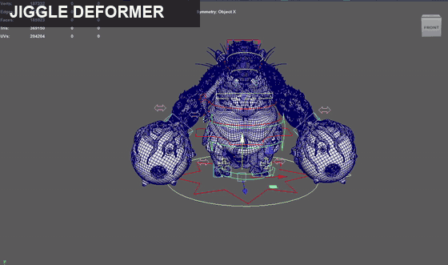

<div align="center">


<a href="https://git.io/typing-svg">
  
</a>

<p align="center">
  <a href="README.md"></a>
  <a href="README.ko.md"></a>
  
</p>

<br/>

</div>

<br/>


<br/>

<div align="center">

| 🎓 卒業 | 🎯 希望職種 | 📍 希望勤務地 | 🗣️ 言語 |
|:---:|:---:|:---:|:---:|
| 2029年卒業予定 | Technical Artist | 日本 · アメリカ | 韓国語 · 日本語 · 英語 |

<a href="https://vivivit.com/hotbar"></a>
<a href="mailto:kws4510@naver.com"></a>

</div>

<br/>


<br/>

```hlsl
// Woonsama.hlsl
float3 Woonsama(float2 uv)
{
    float3 art  = Artist(uv);      // ルック・色・演出を見る目
    float3 tech = Programmer(uv);  // それをリアルタイムで形にする手
    return lerp(art, tech, 0.5);   // その間のどこかにいる人
}
```

> *アーティストの感性とプログラマーの論理をつなぐ Technical Artist。*
> *彫り上げたキャラクターに骨と動きを与え、シェーダーで彩り、エンジン内で仕上げます。*

**主な技術**

- 🌀 **Houdini** によるプロシージャル開発
- ✨ **Unity · Unreal · DirectX** での HLSL シェーダー制作
- 🦴 **Maya** でのリギング、スキニング（ngSkinTools 使用）、アニメーション作業
- 🐍 **Python** によるリグツール制作
- 💻 **プログラミング** — C++, C#
- 📫 **Contact** — kws4510@naver.com

<br/>


<br/>

<div align="center">


</div>

<br/>


<br/>

<div align="center">


| 🦴 Skeleton | 🎛️ Controls | 🪢 Skinning | 🔁 Deform |
|:---:|:---:|:---:|:---:|
| ジョイント構造設計 | FK / IK コントローラー | ngSkinTools によるスキンウェイト | ブレンドシェイプ · 補正シェイプ |

</div>

> キャラクターが*動いたとき*に最も美しく見えるよう、モデリング段階からリギングを意識して制作します。

<br/>


<br/>

<div align="center">

<!--
  ギャラリーの使い方（作品が揃ったらこのコメントを外してください）
  1) 画像は assets/ フォルダに置きます。(例: assets/rig_01.gif)
  2) 下の表のファイル名を変えるだけです。

<table>
  <tr>
    <td></td>
    <td></td>
    <td></td>
  </tr>
  <tr>
    <td align="center"><b>Character Sculpt</b><br/><sub>ZBrush</sub></td>
    <td align="center"><b>Rig Test</b><br/><sub>Maya</sub></td>
    <td align="center"><b>Shader Study</b><br/><sub>Unity</sub></td>
  </tr>
</table>
-->

<table>
  <tr>
    <td align="center" valign="middle"><br/><sub>🎞️ <b>F35-B</b></sub></td>
    <td align="center" valign="middle"><br/><sub>🦴 <b>Biped Rig</b></sub></td>
  </tr>
  <tr>
    <td align="center" valign="middle" colspan="2"><br/><sub>🫧 <b>Jiggle Deformer</b></sub></td>
  </tr>
</table>


</div>

<br/>


<br/>

<div align="center">

**3D / Art**


**Engine / Graphics**


**Video / Motion**


**Procedural / Programming**


**AI**


</div>

<br/>

<div align="center">


</div>
