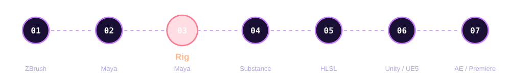
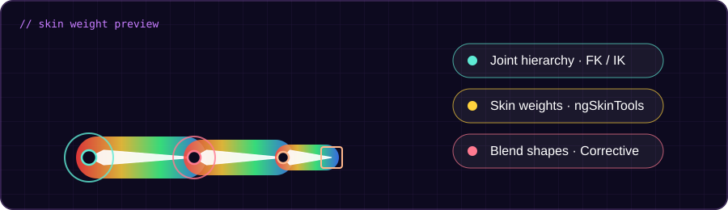
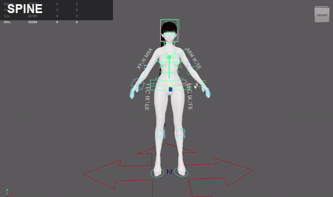
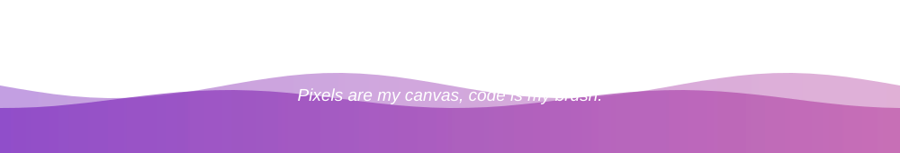

<div align="center">



<a href="https://git.io/typing-svg">
  
</a>

<p align="center">
  <a href="README.md"></a>
  
  <a href="README.ja.md"></a>
</p>

<br/>

</div>

<br/>


<br/>

```hlsl
// Woonsama.hlsl
float3 Woonsama(float2 uv)
{
    float3 art  = Artist(uv);      // 룩, 컬러, 연출을 보는 눈
    float3 tech = Programmer(uv);  // 그걸 실시간으로 구현하는 손
    return lerp(art, tech, 0.5);   // 둘 사이 어딘가에 있는 사람
}
```

> *아티스트의 감각과 개발자의 논리를 잇는 Technical Artist.*
> *조각한 캐릭터에 뼈대와 움직임을 불어넣고, 셰이더로 칠해 엔진 안에서 완성합니다.*

**주요 기술**

- 🌀 **Houdini**를 이용한 프로시저럴 개발
- ✨ **Unity · Unreal · DirectX**를 이용한 HLSL 셰이더 제작
- 🦴 **Maya**를 이용한 리깅 및 스키닝(ngSkinTools 활용), 애니메이션 작업
- 🐍 **Python**을 이용한 Rig 툴 제작
- 💻 **프로그래밍** — C++, C#
- 📫 **Contact** — kws4510@naver.com

<br/>


<br/>

<div align="center">



</div>

<br/>


<br/>

<div align="center">




| 🦴 Skeleton | 🎛️ Controls | 🪢 Skinning | 🔁 Deform |
|:---:|:---:|:---:|:---:|
| Joint 구조 설계 | FK / IK 컨트롤러 | ngSkinTools 기반 스킨 웨이트 작업 | Blend Shape · 보정 셰이프 |

</div>

> 캐릭터가 *움직였을 때* 가장 예뻐 보이도록, 모델링 단계부터 리깅을 염두에 두고 작업합니다.

<br/>


<br/>

<div align="center">

<!--
  갤러리 사용법 (작업물이 준비되면 이 주석을 풀어서 사용하세요)
  1) 이미지는 저장소의 assets/ 폴더에 올립니다. (예: assets/rig_01.gif)
  2) 아래 표의 파일명만 바꾸면 됩니다.

<table>
  <tr>
    <td></td>
    <td></td>
    <td></td>
  </tr>
  <tr>
    <td align="center"><b>Character Sculpt</b><br/><sub>ZBrush</sub></td>
    <td align="center"><b>Rig Test</b><br/><sub>Maya</sub></td>
    <td align="center"><b>Shader Study</b><br/><sub>Unity</sub></td>
  </tr>
</table>
-->

<table>
  <tr>
    <td align="center" valign="middle"><br/><sub>🎞️ <b>F35-B</b></sub></td>
    <td align="center" valign="middle"><br/><sub>🦴 <b>Biped Rig</b></sub></td>
  </tr>
</table>


</div>

<br/>


<br/>

<div align="center">

**3D / Art**


**Engine / Graphics**


**Video / Motion**


**Procedural / Programming**


**AI**


</div>

<br/>

<div align="center">



</div>
